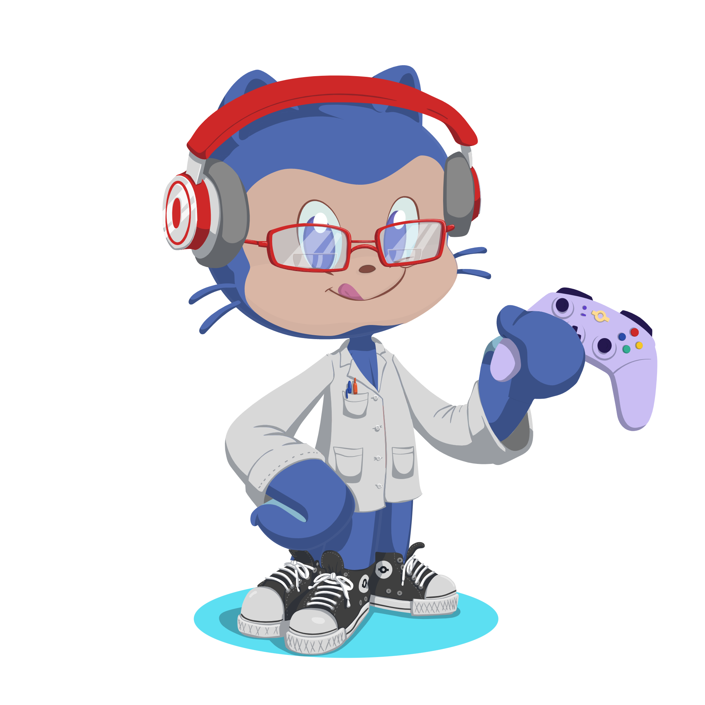

  
  <h1 align="left" style="writing-mode:vertical-rl;background-image:linear-gradient:(to right, #3bd9d9, #b527cf)">Hi There 👋</h1>

  
  

<!--Most Used Languages-->

    

###
###
###

<!--Github Trophies-->
### 🏆 GitHub Trophies

    

<!--Snake-->

  
  

<!--Attribute Stats-->

  
  

<!--Sequence Strike-->

 
 
  

  

<!--Git Info-->

    

<!--
**Audrey-Costa/Audrey-Costa** is a ✨ _special_ ✨ repository because its `README.md` (this file) appears on your GitHub profile.

Here are some ideas to get you started:

- 🔭 I’m currently working on ...
- 🌱 I’m currently learning ...
- 👯 I’m looking to collaborate on ...
- 🤔 I’m looking for help with ...
- 💬 Ask me about ...
- 📫 How to reach me: ...
- 😄 Pronouns: ...
- ⚡ Fun fact: ...
-->
